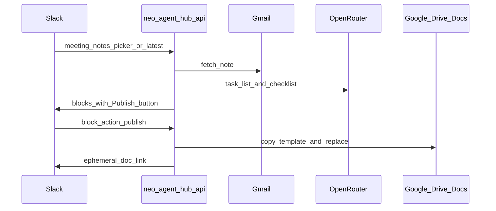

# Engineering map: Meeting notes → Drive publish (`meeting-notes-drive`)

**Agent id:** `meeting-notes-drive`  
**Extends:** `meeting-notes` (same Gmail fetch + OpenRouter checklist)  
**New UX:** Block action **Publish to Drive** after checklist is shown

## Data flow

## Google OAuth scope change

Today [`google-oauth.ts`](../../apps/slack-api/src/google-oauth.ts) requests:

- `openid`, `email`, `https://www.googleapis.com/auth/gmail.readonly`

**Add for Drive publish:**

| Scope | Use |
|-------|-----|
| `https://www.googleapis.com/auth/drive.file` | Create/update files the app creates (per-user consent) |
| `https://www.googleapis.com/auth/documents` | Insert structured text into Google Docs |

**GCP console**

1. OAuth consent screen → add scopes above (sensitive; keep internal/test users until verified if needed).
2. No new redirect URI; same `GOOGLE_OAUTH_REDIRECT_URI`.

**Code**

- Extend `scope` array in `handleGoogleOAuthStart`.
- Store same encrypted refresh token in `user_connections` (no schema change).
- **Re-consent:** users who connected before must run Connect Google again (`prompt=consent` already set on start).

Optional future: store `google_scopes_granted` column; out of scope for first ship (fail at Drive API with “Reconnect Google” message if 403).

## Drive / Docs implementation

| Step | API | Detail |
|------|-----|--------|
| 1 | `drive.files.copy` | Template Doc id from env `MEETING_NOTES_DRIVE_TEMPLATE_ID` |
| 2 | `docs.documents.batchUpdate` | Replace placeholders or append sections: Decisions, Tasks, Checklist, SEO notes |
| 3 | `drive.files.update` | Name: `Meeting recap – {clientLabel} – {date}`; parent folder `MEETING_NOTES_DRIVE_FOLDER_ID` optional |

New module: `apps/slack-api/src/meeting-notes-drive.ts`  
Inputs: refresh token, `MeetingNote` + checklist JSON from existing types.

**Template contract (Doc)**

Placeholders (plain text in template):

- `{{MEETING_DATE}}`, `{{SUBJECT}}`, `{{TASK_LIST}}`, `{{CHECKLIST}}`, `{{SOURCE_MESSAGE_ID}}`

Prompt-level: OpenRouter output already structured in `meeting-notes-checklist.ts`; Drive publish uses that object, not re-parsing Slack mrkdwn.

## Slack interactions

Extend [`meeting-notes-interactions.ts`](../../apps/slack-api/src/meeting-notes-interactions.ts):

| `action_id` | Handler |
|-------------|---------|
| `meeting_notes_publish_drive` | Payload includes `message_id` (Gmail id) cached in `private_metadata` or refetch latest checklist |

Pattern: same as **Create task list** button; ack within 3s, async publish.

## Hub settings (optional v2)

| Key | Storage |
|-----|---------|
| `meeting_notes_template_doc_id` | `hub_settings` or env only for v1 |
| Per-client template | JSON map in env or Postgres later |

v1: env vars on Render only (`MEETING_NOTES_DRIVE_TEMPLATE_ID`, `MEETING_NOTES_DRIVE_FOLDER_ID`).

## Registry and manifest

- `packages/core/src/agents.ts`: `meeting-notes-drive`, `requiresGoogle: true`, `status: disabled` until button ships; or fold into `meeting-notes` description without separate slash command.
- No new slash command required if publish is only a button on existing flow.

## Murphy's Law

| Failure | Behavior |
|---------|----------|
| Gmail ok, Drive 403 | Ephemeral: “Reconnect Google to allow Drive publish.” + connect URL |
| Missing template env | Ephemeral: “Drive template not configured on server.” |
| Docs batchUpdate partial failure | Fail job; do not post broken link; log `documentId` |
| Duplicate publish clicks | Dedupe via `agent_runs.dedupe_key` = `drive:{messageId}:{userId}` |

## Verification (when built)

- [ ] New user OAuth includes Drive scopes in consent screen
- [ ] Publish creates Doc in correct folder
- [ ] Slack shows link; Doc content matches checklist
- [ ] User without re-consent gets explicit 403 path
