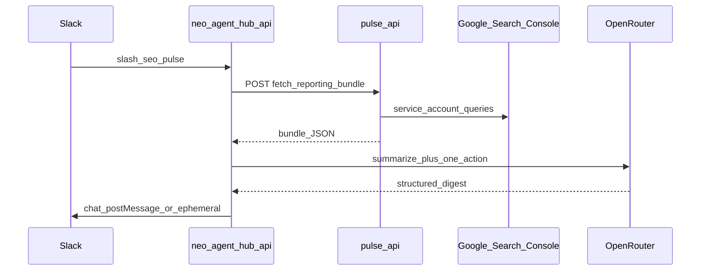

# Engineering map: Client SEO pulse (`client-seo-pulse`)

**Agent id:** `client-seo-pulse`  
**Slack entry:** `/seo-pulse` (optional args: site slug, channel override) + future Render cron  
**Status in registry:** `disabled` until Pulse bridge ships

## Data flow



## Pulse / Flowbie (source of truth for GSC)

Neo Pulse already loads GSC via **service account JSON in site settings**, not per-user Google OAuth in the hub.

| Capability | Pulse location (Flowbie repo) | Notes |
|------------|-------------------------------|--------|
| Reporting bundle fetch | `POST /api/gsc/fetch-reporting-bundle` | Used by GSC reporting tab and automations; returns aggregated MoM/YoY-style metrics for the active site. |
| Reporting harness / agent | `gsc-reporting-agent-harness.ts`, `run-gsc-reporting-client-harness.ts` | OpenRouter turns bundle into narrative; reuse prompt shape for Slack digest (new hub module, do not duplicate bundle fetch in hub). |
| Site context | Site selector / integrations settings | Hub must pass **site id** or **property URL** Pulse understands. |

**Hub must not** call Google Search Console directly with Slack user tokens. **Occam path:** hub → Pulse API only.

## Proposed Pulse ↔ Hub contract (to implement in Pulse)

Add an **internal** authenticated route (example):

| Method | Path | Auth | Body |
|--------|------|------|------|
| `POST` | `/api/internal/seo-pulse` | `X-Hub-Service-Token` (env on both services) | `{ "siteId": "...", "period": "mom" }` |

Response (JSON, validated in hub):

```json
{
  "siteLabel": "string",
  "periodLabel": "string",
  "clicksDelta": "number",
  "impressionsDelta": "number",
  "topQueries": [{ "query": "string", "clicks": "number", "delta": "number" }],
  "bundleRef": "opaque id for support"
}
```

Hub then calls OpenRouter with a **fixed JSON schema** (`digest`, `recommendedAction`, `ownerHint`) and posts Block Kit to Slack.

**Alternative (smaller first slice):** hub cron hits existing `fetch-reporting-bundle` with the same session/service token Pulse uses for server-side jobs, if such a machine token already exists. Prefer explicit internal route to avoid coupling to browser session cookies.

## Neo Agent Hub modules (new)

| File | Responsibility |
|------|----------------|
| `packages/core/src/agents.ts` | Registry row `client-seo-pulse` |
| `apps/slack-api/src/seo-pulse-command.ts` | Parse args, call Pulse, call OR, respond |
| `apps/slack-api/src/seo-pulse-summarize.ts` | OpenRouter + zod schema |
| `apps/slack-api/src/pulse-client.ts` | `PULSE_API_BASE`, `HUB_PULSE_SERVICE_TOKEN` |
| `apps/slack-api/src/index.ts` | Register `/seo-pulse` |
| `slack-app-manifest.json` | Slash command + scopes unchanged if bot posts to channels (`chat:write` already) |

## Configuration

| Env (hub) | Purpose |
|-----------|---------|
| `PULSE_API_BASE` | e.g. `https://neopulse.app` or local dev |
| `HUB_PULSE_SERVICE_TOKEN` | Shared secret for internal Pulse route |
| `SEO_PULSE_DEFAULT_CHANNEL` | Optional default `C…` id per workspace |
| `SEO_PULSE_SITE_MAP_JSON` | Slack channel id → Pulse `siteId` map |

OpenRouter: existing `hub_settings` key path (same as meeting-notes).

## Slack manifest

```json
{
  "command": "/seo-pulse",
  "description": "Post GSC digest and one recommended action",
  "usage_hint": "[site-slug]",
  "url": "https://neo-agent-hub-api.onrender.com/slack/commands"
}
```

## Registry entry

See `packages/core/src/agents.ts` → `client-seo-pulse` (`disabled`, `requiresGoogle: false`).

## Murphy's Law

| Failure | Behavior |
|---------|----------|
| Pulse 401/403 | Ephemeral: “Pulse bridge not configured or token invalid.” |
| Unknown site slug | Ephemeral: list configured slugs from `SEO_PULSE_SITE_MAP_JSON`. |
| Empty GSC bundle | Ephemeral: “No GSC data for this period; check property access in Pulse.” |
| OpenRouter invalid JSON | Ephemeral: “Summary failed validation; ops check logs.” No silent fallback copy. |

## Verification (when built)

- [ ] `npm run build` in neo-agent-hub
- [ ] Staging: `/seo-pulse` with test site returns ephemeral digest
- [ ] Pulse logs show single bundle fetch per invocation
- [ ] Wrong site id fails fast with visible message
